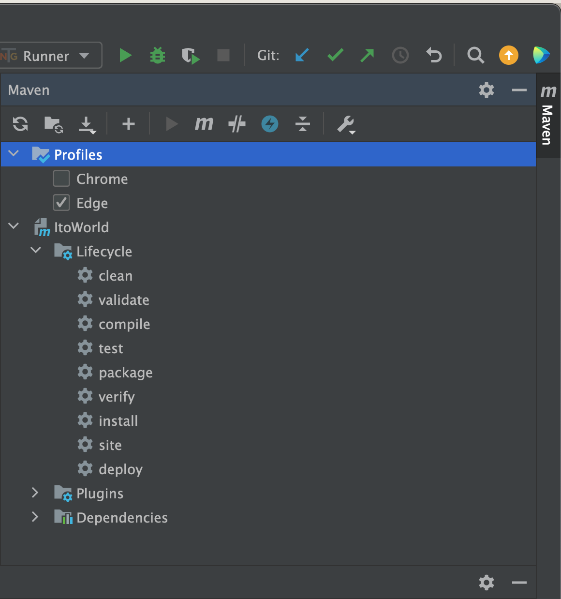
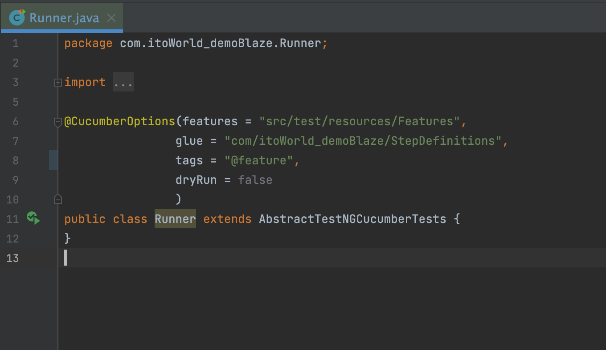

## Project Name and Description:

### ITO WORLD - UI TASK

#### FullName = Sinan Yilmaz | Software Test Automation Engineer

This automation test project was developed for an interview with ITO WORLD. It utilizes Java as the programming
language, Selenium for browser automation, Maven as the project management tool, and TestNG for the framework structure,
following the Page Object Model (POM).

## Installation

Install Java JDK.17 [oracle](https://www.oracle.com/java/technologies/javase/jdk17-archive-downloads.html). <br>
Install IntelliJ IDE this [link](https://www.jetbrains.com/idea/download/?section=mac) for mac OS and
this [one](https://www.jetbrains.com/idea/download/?section=windows) for the Windows OS or make ready your desired IDE.

Step 1: Clone the project from [here](https://github.com/SinanYilmazUK/ItoWorld_UITask.git) <br>
Step 2: Build the project from the top of the IDE. <br>
** Please make sure all dependencies at pom.xml file have been installed properly**. <br> There should not be any red
dependencies.

## Test Execution

#### Go to the Maven menu to select a browser <br>

Select the browser from the Maven profile section to run tests on it. <br>
Click on the first icon on the left in the Maven menu to change the system property for the browser name. <br>



#### Go to Runner class to run feature scenarios <br>

Check that the dryRun is false and place any tag from the feature file.For example, ```@authentication``` for
Authentication page. Same for the other feature files. <br>
Click the run button to the left of the Runner class. <br>




